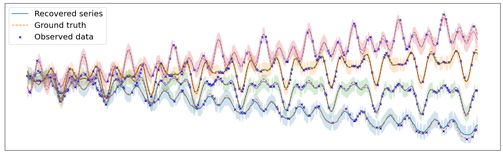

# (ICML 2024 Spotlight) BayOTIDE: Bayesian Online Multivariate Time Series Imputation with Functional Decomposition

(This repo is still on update)

This authors' official PyTorch implementation for paper:"**Bayesian Online Multivariate Time Series Imputation with Functional Decomposition**"[[OpenReview]](https://openreview.net/forum?id=aGBpiEcB8z&referrer=%5BAuthor%20Console%5D(%2Fgroup%3Fid%3DICML.cc%2F2024%2FConference%2FAuthors%23your-submissions))[[Arxiv](https://arxiv.org/abs/2308.14906)] (ICML 2024).


## Citing BayOTIDE
> 🌟 If you find this resource helpful, please consider to star this repository and cite our research:

```tex
@inproceedings{fang2024tsi,
      title={BayOTIDE: Bayesian Online Multivariate Time series Imputation with functional decomposition}, 
      author={Shikai Fang and Qingsong Wen and Yingtao Luo and Shandian Zhe and Liang Sun},
      booktitle={International Conference on Machine Learning (ICML 2024)},
      year={2024}
}
```
In case of any questions, bugs, suggestions or improvements, please feel free to open an issue.

---
## Key Idea
Decompose Multivariate Time as Latent Functions Factors + Online Filtering


<!-- <!-- <div align=center>  </div> -->

<div align=center>  </div>

---


<!-- Example of latent functions of spatial and temporal modes learned from real-world data.
<div align=center>  </div>
<div align=center>  </div> -->

## Requirements:
The project is mainly built with **pytorch 2.3.0** under **python 3.10**. The detailed package info can be found in `requirement.txt`.

## Instructions:
1. Clone this repository.
2. To play with the model quickly, we offer several notebooks at `notebook`(on synthetic & real data)
3. To run the real-world datasets with scripts, see `run_script.sh` for example. (download the processed data of *Solar-Power* and *Uber-Move*  from the link below first)
4. To tune the (hyper)parametrs of model, modify the `.yaml` files in `config` folder
5. To apply the model on your own dataset, please follow the [process_script](https://github.com/xuangu-fang/BayOTIDE/tree/master/data/process_script) to process the raw data into appropriate format.
6. GPU choice: the models are run on CPU by default, but you can change the device to CPU by modifying the `device` as `cpu` of `.yaml` files in the `config` folder.


## Data

We offer the **raw data**,  **processed data** and **processed scripts** for all three datasets used in paper. Given the large size of  *Solar-Power* and *Uber-Move*, we put them in the [google drive](https://drive.google.com/drive/folders/1KtxKwGaUAFnKWXwjUzjZ64hmYlda2Qtl?usp=sharing).

- Traffic-Guangzhou: [raw data](https://github.com/xuangu-fang/BayOTIDE/blob/master/data/raw/tensor.mat), [processed scripts](https://github.com/xuangu-fang/BayOTIDE/blob/master/data/process_script/data_process_guangzhou.ipynb), and [processed data](https://github.com/xuangu-fang/BayOTIDE/tree/master/data/guangzhou) 

- Solar-Power: [raw data](https://drive.google.com/drive/folders/1KtxKwGaUAFnKWXwjUzjZ64hmYlda2Qtl?usp=sharing), [processed scripts](https://github.com/xuangu-fang/BayOTIDE/blob/master/data/process_script/data_process_solor.ipynb), and [processed data](https://drive.google.com/drive/folders/1KtxKwGaUAFnKWXwjUzjZ64hmYlda2Qtl?usp=sharing) 

- Uber-Move: [raw data](https://drive.google.com/drive/folders/1KtxKwGaUAFnKWXwjUzjZ64hmYlda2Qtl?usp=sharing), [processed scripts](https://github.com/xuangu-fang/BayOTIDE/blob/master/data/process_script/data_process_uber.ipynb), and [processed data](https://drive.google.com/drive/folders/1KtxKwGaUAFnKWXwjUzjZ64hmYlda2Qtl?usp=sharing) 


The code for generating the synthetic data is also provided in the [notebook]( https://github.com/xuangu-fang/BayOTIDE/blob/master/data/process_script/gen_simu.ipynb).


If you wanna customize your own data to play the model, please follow the notebooks in `data/process_script/`.


## Further Reading
1, Deep Learning for Multivariate Time Series Imputation: A Survey, in *arXiv* 2024. 
[\[paper\]](https://arxiv.org/abs/2402.04059) [\[Website\]](https://github.com/wenjiedu/awesome_imputation)

2, AI for Time Series (AI4TS) Papers, Tutorials, and Surveys. 
[\[Website\]](https://github.com/qingsongedu/awesome-AI-for-time-series-papers)


 

